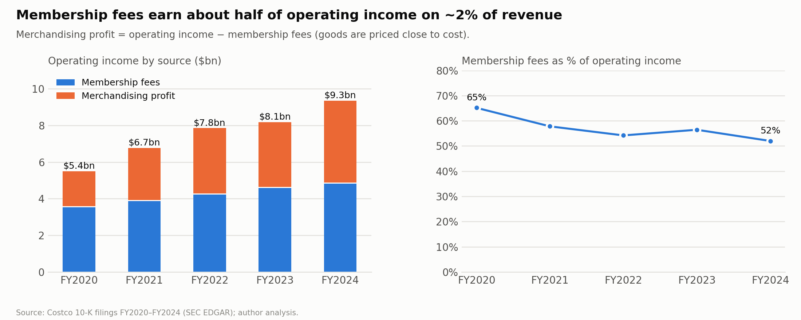

# Costco Wholesale (COST): Equity Research and Valuation

> **Independent academic research and valuation case study; not investment advice.** See [DISCLAIMER.md](DISCLAIMER.md).

A fundamental equity research project on Costco Wholesale Corporation. It covers historical
financial-statement analysis from SEC filings (FY2020–FY2024), a driver-based forecast,
a DCF valuation, a WACC build, comparable-company analysis, sensitivity analysis and a two-page investment memo.

**Valuation date:** 31 January 2025. All market inputs (share prices, risk-free rate, peer multiples) are as of this date.
Only filings public by this date are used.

## Project status

| Phase | Scope | Status |
|---|---|---|
| 1. Data | SEC EDGAR / XBRL extraction, source tracking, 30 integrity tests | **Done**, see [docs/data_sources.md](docs/data_sources.md) |
| 2. Historical analysis | Growth, margins, membership, ROIC, working capital, cash flow | **Done**, see [findings](docs/historical_analysis.md) and the [notebook](notebooks/01_historical_analysis.ipynb) |
| 3. Forecast | Driver-based, integrated three-statement model FY2025–FY2029 | **Done**, see [assumptions](docs/assumptions.md) |
| 4. WACC & DCF | Cost of capital, UFCF, terminal value | Not started |
| 5. Comparable companies | Peer selection, multiples | Not started |
| 6. Sensitivity & scenarios | WACC × g, revenue × margin, bear/base/bull | Not started |
| 7. Excel model | Fully linked workbook | Not started |
| 8. Memo & slides | Two-page memo, thesis slide, risks slide | Not started |

## Repository layout

```
config/          settings.json (company, peers, valuation date), assumptions.json (forecast)
src/             Python pipeline
data/raw/        SEC downloads (git-ignored; manifest.csv is committed)
data/manual/     figures hand-collected from filing text, each with a citation
data/processed/  clean, source-tracked datasets
notebooks/       analysis notebooks
docs/            methodology, data sources, assumptions
outputs/         model, tables, charts, memo, slides
tests/           data-integrity and model tests
```

## Historical analysis: highlights

- **Membership fees are 1.9% of revenue but 52% of operating income** (FY2024), with a 92.9% U.S./Canada renewal rate.
- **~30% return on invested capital**, while capex runs at about 2x depreciation to fund new warehouses.
- **Negative working capital (about −5% of revenue):** suppliers and members finance growth.
- **Growth normalized** after the FY2021–22 surge to 5–6% comparable sales (ex gas & FX) plus ~2 points from new warehouses.



More in [docs/historical_analysis.md](docs/historical_analysis.md) and the [chart pack](outputs/charts/).

## Base-case forecast (FY2025–FY2029)

Revenue is built from warehouse openings, comparable sales and membership fees (members × fee per member, including the
Sep 2024 fee increase). Every assumption is tied to the filings and explained in [docs/assumptions.md](docs/assumptions.md).
The three statements are fully linked, and tests confirm the balance sheet balances every year.

| $m | FY24A | FY25E | FY29E |
|---|---:|---:|---:|
| Revenue | 254,453 | 273,712 | 349,529 |
| Operating margin | 3.65% | 3.72% | 3.77% |
| Diluted EPS ($) | 16.56 | 17.31 | 23.13 |
| Free cash flow | 6,629 | 7,032 | 9,240 |

## Data

FY2020–FY2024 historical data (and the FY2019 opening balance sheet) is extracted straight from the
inline XBRL in Costco's 10-K filings. Every number carries a link to the exact tagged fact in the filing.
Operating metrics (members, renewal rates, comparable sales) are stored with the verbatim sentence they
come from, and are re-verified against the filing text on every build.
320 values were cross-checked against the SEC companyfacts API, and all 320 match. See [docs/data_sources.md](docs/data_sources.md).

| Dataset | File |
|---|---|
| Income statement / balance sheet / cash flow ($m) | `data/processed/income_statement.csv`, `balance_sheet.csv`, `cash_flow.csv` |
| Segments and merchandise categories | `data/processed/segments.csv` |
| Operating metrics | `data/processed/operating_metrics.csv` |
| Every number with its source link | `data/processed/financials_long.csv`, `operating_metrics_long.csv` |

## Reproducing

```bash
python3 -m venv .venv && source .venv/bin/activate
pip install -r requirements.txt
export SEC_USER_AGENT="Your Name your.email@example.com"   # the SEC requires contact details
python -m src.sec_fetch
python -m src.extract_financials
python -m src.operating_metrics
python -m src.historical           # metrics -> outputs/tables/
python -m src.extract_quarter      # Q1 FY2025 10-Q (latest quarter before the valuation date)
python -m src.forecast             # three-statement forecast -> outputs/tables/forecast_*.csv
python -m src.charts               # chart pack -> outputs/charts/
python -m pytest -q
jupyter notebook notebooks/01_historical_analysis.ipynb
```
