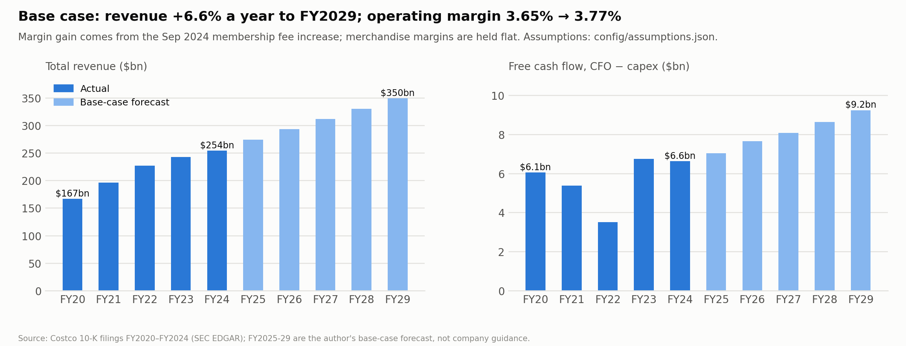

# Forecast assumptions: base case, FY2025–FY2029

*Independent academic research and valuation case study; not investment advice.*

- **Assumption values and full rationale:** [`config/assumptions.json`](../config/assumptions.json), the single file the model reads.
- **Model:** [`src/forecast.py`](../src/forecast.py). It is an integrated three-statement model, with cash as the only plug.
- **Output tables:** `outputs/tables/forecast_*.csv`.
- **Information cut-off:** only filings public by the **31 Jan 2025** valuation date. That means the FY2024 10-K and the Q1 FY2025 10-Q (quarter to 24 Nov 2024).



## How revenue is built

```
Warehouses(t)      = Warehouses(t-1) + net new openings
Net sales growth   = (1 + comparable sales growth) × (1 + 0.65 × net unit growth) − 1
Membership fees    = average paid members × fee per average member
Fee per member     = prior year × (1 + share of the Sep-2024 fee increase recognized this year)
Total revenue      = net sales + membership fees
```

## Assumptions and why

| Driver | FY25E | FY26E | FY27E | FY28E | FY29E | Why |
|---|---:|---:|---:|---:|---:|---|
| Net new warehouses | 26 | 27 | 27 | 27 | 27 | FY25 = management plan (29 openings incl. 3 relocations, Q1 FY25 10-Q); then the FY24–25 average |
| Comparable sales (reported) | 5.5% | 5.0% | 4.5% | 4.0% | 4.0% | Q1 FY25: 5% reported / 7% ex gas & FX. Fades to ~inflation plus 1.5–2 pts of traffic and share gains |
| Growth from new warehouses | 1.9% | 1.9% | 1.9% | 1.8% | 1.8% | 0.65 × unit growth. Historical ratio 0.60–0.70 (new warehouses open below the fleet average) |
| **Net sales growth** | **7.5%** | **7.0%** | **6.4%** | **5.9%** | **5.8%** | Q1 FY25 net sales grew 7.5%, a cross-check on FY25 |
| Paid member growth | 7.0% | 6.5% | 6.0% | 5.5% | 5.0% | FY21–24 average 7.0%; Q1 FY25 +7.5% year on year. Fades as more openings are in existing markets |
| Fee increase recognized | +3.5% | +3.5% | – | – | – | $60→$65 and $120→$130 (+8.3%) on ~85% of fee income. Recognized over the membership year, so half in FY25 and half in FY26 |
| **Membership fee growth** | **10.9%** | **10.5%** | **6.2%** | **5.7%** | **5.2%** | Members × fee per member |
| Gross margin (on net sales) | 11.0% | 11.0% | 11.0% | 11.0% | 11.0% | FY24 10.92%; Q1 FY25 +24bp year on year. Held flat because Costco reinvests margin in price |
| SG&A (% net sales) | 9.20% | 9.20% | 9.20% | 9.20% | 9.20% | FY24 9.14%; Q1 FY25 +14bp. **No further leverage assumed** (wages and technology offset it) |
| Tax rate | 26% | 26% | 26% | 26% | 26% | Rate excluding one-off (discrete) items was 25.9–26.6% in FY20–24 |
| D&A (% of beginning net PP&E) | 8.4% | 8.4% | 8.4% | 8.4% | 8.4% | FY21–24: 8.1–8.4% |
| Capex | $5.0bn | 1.85% of revenue | 1.85% | 1.85% | 1.85% | FY25 = management plan; FY21–24 ran at 1.71–1.85% of revenue |
| Operating working capital | −4.8% of revenue | ← | ← | ← | ← | Each line held at its FY24 ratio, so growth releases ~$0.9–1.0bn of cash a year |
| Interest income yield on cash | 3.5% | 3.25% | 3.0% | 3.0% | 3.0% | FY24 earned 4.1%; the Fed cut rates Sep–Dec 2024 |

**Financing assumptions, used only to balance the statements; they do not affect the unlevered DCF:**
- debt held flat;
- dividends at 27% of net income, with no specials;
- $700m of buybacks a year;
- diluted shares flat at 444.9m.

## Base-case output

| $m | FY24A | FY25E | FY26E | FY27E | FY28E | FY29E |
|---|---:|---:|---:|---:|---:|---:|
| Net sales | 249,625 | 268,355 | 287,172 | 305,679 | 323,658 | 342,530 |
| Membership fees | 4,828 | 5,357 | 5,920 | 6,290 | 6,651 | 7,000 |
| **Total revenue** | **254,453** | **273,712** | **293,092** | **311,969** | **330,309** | **349,529** |
| Operating income | 9,285 | 10,187 | 11,089 | 11,792 | 12,477 | 13,165 |
| Operating margin | 3.65% | 3.72% | 3.78% | 3.78% | 3.78% | 3.77% |
| EBITDA | 11,522 | 12,626 | 13,743 | 14,678 | 15,606 | 16,544 |
| Net income | 7,367 | 7,702 | 8,451 | 9,047 | 9,663 | 10,290 |
| Diluted EPS ($) | 16.56 | 17.31 | 19.00 | 20.33 | 21.72 | 23.13 |
| Capex | 4,710 | 5,000 | 5,422 | 5,771 | 6,111 | 6,466 |
| Free cash flow (CFO − capex) | 6,629 | 7,032 | 7,656 | 8,075 | 8,628 | 9,240 |

**Reading the results:**
- **Operating margin:** it rises from 3.65% to about 3.78% entirely because of the fee increase. Merchandising margins (gross margin minus SG&A) are held at 1.80% of net sales, vs. 1.78% in FY24.
- **FY25 EPS growth:** only +4.5%. FY24 benefited from a 24.4% tax rate, including one-off discrete benefits, and FY25 earns less interest income. **Operating income grows 9.7%.**
- **Excess cash:** with no special dividends assumed, cash builds to about $35bn by FY29. That affects EPS through interest income, not the enterprise value (EV). In practice Costco would likely pay another special dividend.

## Cross-check against the latest quarter (Q1 FY2025, 12 weeks to 24 Nov 2024)

| | Q1 FY25 actual (y/y) | FY25E model | Comment |
|---|---:|---:|---|
| Net sales growth | +7.5% | +7.5% | In line |
| Comparable sales | 5% (7% ex gas & FX) | 5.5% | Assumes gas and FX headwinds ease slightly |
| Membership fee growth | +7.8% | +10.9% | The model expects acceleration as more of the fee increase is recognized in Q2–Q4 |
| Gross margin change | +24bp | +8bp | Conservative |
| SG&A % net sales change | +14bp | +6bp | Q1 is affected by gasoline deflation |
| Paid members | 77.4m (+7.5%) | 81.5m at year end (+7.0%) | Consistent |

## The three statements link

`tests/test_forecast.py` checks every forecast year:
- the balance sheet balances;
- the change in cash equals the cash flow statement;
- equity rolls forward (net income + stock-based compensation − dividends − buybacks);
- PP&E rolls forward (beginning + capex − D&A);
- the income statement adds up.

It also checks that FY25 warehouses and capex match management's plan, and that raising comparable sales raises revenue and cash while the balance sheet still balances.

## Known simplifications

- **52-week basis:** FY2028 will actually be a 53-week year. The extra week (~2% of that year's sales) is excluded so growth rates stay comparable.
- **PP&E roll-forward:** it ignores disposals and FX, which historically left actual PP&E $0.1–0.8bn below beginning + capex − D&A.
- **Other items:** other comprehensive income is not forecast, and leases and other long-term items are held flat.
- **Next fee increase:** the next one, historically every 5.5–7 years, would fall around FY2030–31. It is excluded from the explicit forecast and is an upside risk.

## Inputs carried into Phase 4 (DCF)

EBIT, the 26% tax rate, D&A, capex and the change in working capital for FY2025–29 are in `outputs/tables/forecast_*.csv`.
Unlevered free cash flow uses these, with stock-based compensation treated as a real cost (not added back).
