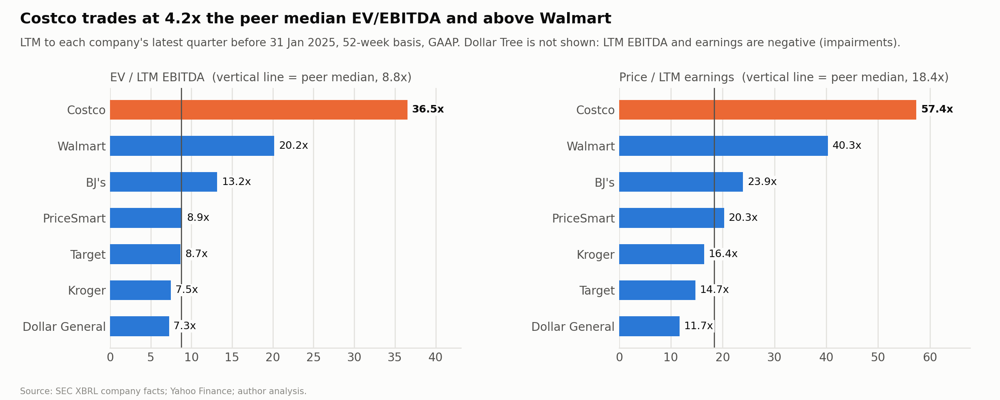

# Comparable-company analysis (as of 31 January 2025)

*Independent academic research and valuation case study; not investment advice.*

- **Code:** [`src/comps.py`](../src/comps.py) and [`src/ltm.py`](../src/ltm.py).
- **Peer set:** [`config/peers.json`](../config/peers.json).
- **Output tables:** `outputs/tables/comps*.csv`.

## Peer selection

No listed company copies Costco's model: membership fees plus warehouse retail at near-cost prices. So the peers are grouped by how close their economics are. The criteria were business model, merchandise overlap (grocery and consumables), customer, geography (mainly U.S.), scale, margin structure and capital intensity.

| Peer | Tier | Why it is comparable | Main differences |
|---|---|---|---|
| **BJ's Wholesale (BJ)** | 1 | The only other listed U.S. membership warehouse club: same fee-plus-low-margin model, bulk packs, gasoline | About 8% of Costco's revenue; regional (eastern U.S.) |
| **Walmart (WMT)** | 1 | Owns Sam's Club, Costco's direct club competitor. Largest U.S. grocer, same everyday-low-price positioning, fights for the same household budget | Sam's Club is only ~13% of Walmart's revenue. Faster-growing e-commerce and advertising income, plus large international operations |
| **PriceSmart (PSMT)** | 1 | A listed membership warehouse club outside the U.S.: annual fee, bulk formats, limited SKUs; fiscal year ends 31 Aug like Costco's | About 2% of Costco's revenue; operates in Latin America and the Caribbean (emerging-market and currency exposure). Finance leases are not tagged separately, so they are omitted |
| **Target (TGT)** | 2 | General merchandise plus grocery, U.S. suburban households, similar income demographic | Higher margins, no membership fee, more discretionary sales. Revenue flat since FY2022 |
| **Kroger (KR)** | 2 | Largest U.S. traditional supermarket; the core grocery overlap; also runs fuel centers | Grocery only, lower growth. Balance sheet distorted by financing for the (terminated) Albertsons merger |
| **Dollar General (DG)** | 3 | Value-focused consumables retailer competing for price-sensitive shoppers | Small-box rural format, lower-income customer, margin reset in 2024 |
| **Dollar Tree (DLTR)** | 3 | Value / discount consumables | LTM GAAP EBITDA and earnings are **negative** after Family Dollar impairments, so only EV/Revenue is used |

**Excluded:**
- **Amazon:** profits are driven by AWS and advertising, so retail economics cannot be separated out.
- **Albertsons:** its price was distorted by the pending Kroger merger for most of 2024. The merger was terminated in
  December 2024, so by 31 Jan 2025 it traded as a standalone supermarket; at supermarket multiples it would lower the
  median further, so leaving it out does not depress the implied value.
- **Sprouts:** a niche natural-food grocer, small relative to Costco. It is still a useful data point: the market paid a
  premium multiple for a grocer with strong comparable-sales momentum, consistent with growth and durability (not the
  category) driving multiples.
- **PriceSmart** was added to Tier 1 after the external comps review (see docs/model_review_log.md, 3e). With it, Tier 1
  has three data points, so its median is a real middle value rather than the average of two.

## Method

- **Point in time.** Prices are 31 Jan 2025 closes. Share counts are the cover-page figures in each company's latest filing before that date. Balance sheets and LTM figures come from 10-K/10-Q filings filed on or before 31 Jan 2025, via SEC XBRL company facts, so there is no look-ahead.
- **LTM.** Last fiscal year + current year-to-date − prior-year year-to-date, scaled to 52 weeks. BJ's, Target, Dollar Tree and Kroger had 53-week years ending Feb 2024.
- **Enterprise value.** Market cap + debt (including finance leases) + noncontrolling interest − cash − short-term investments. Operating leases are excluded because EBITDA is already after operating lease cost (ASC 842). This is the same definition as the DCF.
- **GAAP, unadjusted.** One-off items (impairments, legal settlements, investment gains) are not removed, which is why medians are used rather than means.
- **Growth-adjusted EV/EBITDA.** EV/EBITDA ÷ 3-year revenue CAGR (in %).

## Results

| | Market cap ($bn) | EV ($bn) | LTM revenue ($bn) | EBITDA margin | Revenue growth (YTD y/y) | 3y revenue CAGR | EV/Revenue | EV/EBITDA | P/E | P/S | Growth-adj. EV/EBITDA |
|---|---:|---:|---:|---:|---:|---:|---:|---:|---:|---:|---:|
| **Costco** | **435.0** | **430.5** | **258.8** | **4.6%** | **7.5%** | **9.1%** | **1.66x** | **36.5x** | **57.4x** | **1.68x** | **4.0** |
| Walmart | 788.6 | 832.0 | 670.1 | 6.2% | 5.4% | 5.1% | 1.24x | 20.2x | 40.3x | 1.18x | 3.9 |
| BJ's | 13.1 | 13.7 | 20.2 | 5.2% | 4.2% | 8.3% | 0.68x | 13.2x | 23.9x | 0.65x | 1.6 |
| Target | 63.2 | 75.7 | 105.5 | 8.3% | 0.2% | 4.0% | 0.72x | 8.7x | 14.7x | 0.60x | 2.1 |
| Kroger | 44.6 | 53.9 | 147.1 | 4.9% | −0.1% | 3.6% | 0.37x | 7.5x | 16.4x | 0.30x | 2.1 |
| Dollar General | 15.6 | 21.3 | 40.2 | 7.3% | 5.1% | 4.7% | 0.53x | 7.3x | 11.7x | 0.39x | 1.6 |
| Dollar Tree | 15.8 | 18.5 | 30.6 | −0.3% | 2.8% | 5.6% | 0.60x | NM | NM | 0.51x | NM |
| PriceSmart | 2.8 | 2.7 | 5.0 | 6.1% | 7.8% | 10.6% | 0.54x | 8.9x | 20.3x | 0.56x | 0.8 |
| **Peer median** | | | | | | | **0.60x** | **8.8x** | **18.4x** | **0.56x** | **1.8** |
| Tier 1 median (WMT, BJ, PSMT) | | | | | | | 0.68x | 13.2x | 23.9x | 0.65x | 1.6 |

## What peer multiples imply for Costco ($ per share)

| Multiple applied to Costco LTM | Peer 25th percentile | Peer median | Peer 75th percentile | Tier 1 median | Walmart alone |
|---|---:|---:|---:|---:|---:|
| EV/EBITDA | $216 | $243 | $331 | $359 | $546 |
| EV/Revenue | $322 | $362 | $418 | $406 | $734 |
| P/E | $259 | $313 | $393 | $408 | $688 |
| P/S | $264 | $327 | $363 | $378 | $686 |

For comparison, the DCF gives **$337** and the share price was **$979.88**.

## Selected range

The pooled peer median is a **floor reference, not a valuation**. At 4.2× the median EV/EBITDA, Costco is not priced like the
median peer, and the dollar stores (both in turnaround in January 2025) pull the median toward distressed-retail multiples.
The selected range therefore anchors on Tier 1 (the three membership-warehouse peers, whose median is BJ's), with Walmart,
the most expensive peer and the only one at Costco's scale, as the ceiling:

| Method | Selected multiple | Implied value per share |
|---|---|---:|
| EV/EBITDA | 13.2x (Tier 1 median) to 20.2x (Walmart) | $359–$546 |
| P/E | 23.9x (Tier 1 median) to 40.3x (Walmart) | $408–$688 |
| **Comps-derived range** | | **~$360–$690** |

- **EV/Revenue and P/S are shown but not used in the selection.** Costco's EBITDA margin (4.6%) is below the peers' by design:
  it prices merchandise near cost and earns its profit from fees. A revenue multiple penalises the model rather than measuring it.
- **Target, Kroger and the dollar stores are reference points only.** Target is at a trough in discretionary categories, Kroger's
  GAAP figures carry merger costs and fuel distorts its revenue, and none of them has fee income.
- **The price is 42–173% above the selected range**: about 2.8x the Tier 1 median and 1.8x Walmart on EV/EBITDA, and 1.4x Walmart
  on P/E. That gap is the Costco-specific premium that comparable companies cannot explain.
- **The DCF ($337) sits below even this range** because its terminal value is equivalent to 10.3x FY2029 EBITDA (see
  docs/valuation.md): it assumes Costco's growth fades to 3% after FY2029, whereas today's Tier 1 multiples embed longer
  runways. At a 20x exit, the DCF gives about $585 (docs/sensitivity.md).

### A rough sum-of-the-parts test

Treat membership fees as ~100% margin, so merchandise EBITDA ≈ LTM EBITDA − LTM fees = $11.8bn − $4.9bn = $6.9bn
(LTM fees = FY2024 $4,828m + Q1 FY25 $1,166m − Q1 FY24 $1,082m). At the Tier 1 multiple of 13.2x, merchandise is worth about
$90bn. The rest of the $430bn market EV, about $340bn, implies **~69x membership fee income**. (At Walmart's 20.2x it would
still be ~60x.) That is above what most
subscription businesses command, so the price reflects more than the fee stream alone.

## Interpretation

1. **The DCF result is not an outlier.** Every peer-based value, from the pooled 25th percentile ($216) to Walmart's P/E ($688), is below the market's $980. Costco's premium is company-specific; the sector is not generally priced this high.
2. **The market pays for quality, and Walmart shows it.** The two highest multiples belong to the two scale leaders with the most durable traffic, Costco and Walmart (20x EBITDA, 40x P/E). The market is paying for resilience and scale, not just growth.
3. **Adjusted for growth, Costco looks close to Walmart, not wildly expensive.** Costco's growth-adjusted EV/EBITDA (4.0) is about the same as Walmart's (3.9), though more than twice the peer median (1.8). Part of the premium is Costco's faster growth: 9.1% 3-year revenue CAGR versus a 3.6–8.3% range for peers.
4. **What the multiples do not capture.** They don't reflect the membership fee annuity: 52% of operating income, 93% renewal, and pricing power shown by the Sep 2024 increase. These qualities help explain why investors accept a far lower return on Costco than CAPM gives (the reverse DCF implied a 4.8% WACC).
5. **Conclusion for the memo.** On both absolute (DCF) and relative (comps) measures, the $980 price is well above what current and forecast cash flows support. The price embeds a scarcity/quality premium that relative valuation cannot "justify", only describe.

## Limitations

- **Small peer set.** Only BJ's and PriceSmart truly share the model, and both are far smaller than Costco. Peer statistics are sensitive to which companies are included.
- **GAAP LTM, no adjustments.** Dollar General (margin reset), Kroger (merger costs) and Walmart (equity-investment gains in net income) are distorted, which affects P/E more than EV/EBITDA.
- **Operating leases and ownership mix.** EV excludes operating leases and EBITDA is after rent, which is internally consistent.
  But Costco owns most of its warehouses while the dollar stores lease nearly everything; an EV/EBITDAR cross-check with
  capitalised leases would remove that distortion. Not done.
- **Dollar Tree.** Its negative GAAP EBITDA comes mainly from non-cash Family Dollar impairments. Adding the impairment back
  would give a meaningful EV/EBITDA; it is left as not meaningful here. It is outside the selected range either way.
- **No forward multiples.** Consensus forecasts are not freely available, so everything is on LTM figures.
- **Walmart's finance leases.** Tagged at quarter end. For BJ's and Kroger, finance leases come from the latest 10-K. For Target and Dollar General they are included in the debt tags. Dollar Tree's and PriceSmart's are not tagged separately and are therefore omitted, a small understatement.
