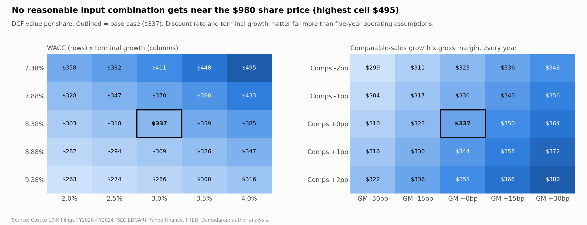
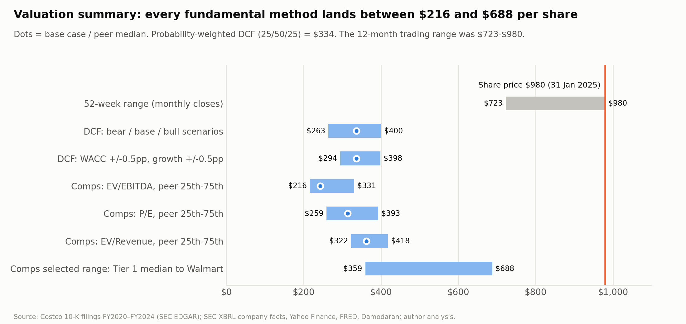

# Sensitivity analysis and scenarios

*Independent academic research and valuation case study; not investment advice.*

- **Code:** [`src/sensitivity.py`](../src/sensitivity.py).
- **Scenario definitions:** [`config/scenarios.json`](../config/scenarios.json).
- **Output tables:** `outputs/tables/sens_*.csv`.

All values are DCF value per share, as of 31 Jan 2025. The base case is **$337**; the share price was **$979.88**.

## 1. WACC × terminal growth

| WACC \ g | 2.0% | 2.5% | 3.0% | 3.5% | 4.0% |
|---|---:|---:|---:|---:|---:|
| 7.38% | $358 | $382 | $411 | $448 | $495 |
| 7.88% | $328 | $347 | $370 | $398 | $433 |
| **8.38%** | $303 | $318 | **$337** | $359 | $385 |
| 8.88% | $282 | $294 | $309 | $326 | $347 |
| 9.38% | $263 | $274 | $286 | $300 | $316 |

**Most favourable cell:** 7.38% WACC with 4% perpetual growth gives $495, about half the price.

## 2. Revenue growth × operating margin

Comparable-sales growth and gross margin are shifted in *every* forecast year, and the full three-statement model is re-run each time.

| | GM −30bp | GM −15bp | GM +0bp | GM +15bp | GM +30bp |
|---|---:|---:|---:|---:|---:|
| Comps −2pp (FY24–29 revenue CAGR 4.6%) | $299 | $311 | $323 | $336 | $348 |
| Comps −1pp (5.6%) | $304 | $317 | $330 | $343 | $356 |
| **Comps +0pp (6.6%)** | $310 | $323 | **$337** | $350 | $364 |
| Comps +1pp (7.6%) | $316 | $330 | $344 | $358 | $372 |
| Comps +2pp (8.6%) | $322 | $336 | $351 | $366 | $380 |

The gross-margin columns move FY2029 operating margin from 3.47% (−30bp) to 4.06% (+30bp); the base case is 3.77%.

**Growth matters less than expected.** Adding 2pp of comparable sales every year raises value by only ~$14 (4%). The terminal value is anchored to 3% growth, so faster growth in FY2025–29 moves only the launch point. Margin matters more: each 15bp of gross margin (about 0.15% of sales) is worth about $13.

## 3. Terminal-year cash flow

The guideline asks for this sensitivity. It is tested two ways.

**(a) Return on new investment (RONIC) × terminal growth.** This sets how much of terminal NOPAT must be reinvested (g ÷ RONIC).

| RONIC \ g | 2.0% | 2.5% | 3.0% | 3.5% | 4.0% |
|---|---:|---:|---:|---:|---:|
| 15% | $290 | $300 | $313 | $327 | $346 |
| 20% | $298 | $312 | $328 | $347 | $370 |
| **25%** | $303 | $318 | **$337** | $359 | $385 |
| 30% | $306 | $323 | $343 | $366 | $395 |
| 35% | $309 | $326 | $347 | $372 | $403 |

**(b) Terminal free cash flow ±10–20% at each WACC.** This is the same as scaling the terminal value.

| WACC \ terminal FCF | −20% | −10% | 0% | +10% | +20% |
|---|---:|---:|---:|---:|---:|
| 7.88% | $310 | $340 | $370 | $400 | $430 |
| **8.38%** | $284 | $310 | **$337** | $363 | $390 |
| 8.88% | $261 | $285 | $309 | $333 | $357 |

The full 5×5 grid is in `outputs/tables/sens_terminal_cf.csv`.

**(c) Cross-check: exit multiple instead of perpetual growth.** Terminal value = multiple × FY2029 EBITDA, at FY2029 year-end
(4.59 years). The base case's growth-formula TV is equivalent to **10.3×**.

| WACC \ FY2029 EV/EBITDA | 10× | 15× | 20× | 25× | 30× |
|---|---:|---:|---:|---:|---:|
| 7.38% | $341 | $475 | $609 | $743 | $877 |
| **8.38%** | $328 | $457 | $585 | $714 | $843 |
| 9.38% | $317 | $440 | $563 | $686 | $810 |

Even a 20× exit (roughly Walmart's current multiple) gives about $585. The price needs **35×** at the base WACC. The market
EV today is 26× FY2029E EBITDA. Full grid: `outputs/tables/sens_wacc_exit_multiple.csv`.

## 4. Bear / base / bull scenarios

WACC is held at 8.38% in all three scenarios, so they isolate *business* outcomes. Discount-rate risk is covered by grid 1.

| | Bear | Base | Bull |
|---|---:|---:|---:|
| Comparable sales (FY25 → FY29) | 4.5% → 2.5% | 5.5% → 4.0% | 6.0% → 5.0% |
| Paid-member growth | 6.0% → 4.0% | 7.0% → 5.0% | 7.5% → 6.0% |
| Net new warehouses / yr (FY26–29) | 22 | 27 | 30 |
| Gross margin / SG&A (% net sales) | 10.85% / 9.30% | 11.00% / 9.20% | 11.10% / 9.15% |
| Terminal growth / RONIC | 2.5% / 15% | 3.0% / 25% | 3.5% / 35% |
| FY24–29 revenue CAGR | 4.9% | 6.6% | 7.6% |
| FY2029 operating margin | 3.57% | 3.77% | 3.86% |
| FY2029 EPS | $20.24 | $23.13 | $24.92 |
| **Value per share** | **$263** | **$337** | **$400** |
| vs. $979.88 price | −73% | −66% | −59% |
| Probability | 25% | 50% | 25% |

**Probability-weighted value: $334.**

**The scenarios in words:**
- **Bear:** a consumer slowdown and price competition. Openings cannibalize existing warehouses, wage and tariff costs push SG&A up, and Costco reinvests margin to defend traffic. Returns on new investment fall toward peer levels.
- **Bull:** comparable sales hold near the FY2023–24 ex-gas run-rate. International expansion lifts openings to 30 a year. Scale, the co-branded card and e-commerce add modest margin, and the moat keeps incremental returns near today's ROIC.

## 5. Valuation summary (football field)

| Method | Low | Central | High |
|---|---:|---:|---:|
| DCF scenarios | $263 | $337 | $400 |
| DCF, WACC ±0.5pp and growth ±0.5pp | $294 | $337 | $398 |
| Comps EV/EBITDA (peer 25th–75th) | $216 | $243 | $331 |
| Comps P/E (peer 25th–75th) | $259 | $313 | $393 |
| Comps EV/Revenue (peer 25th–75th) | $322 | $362 | $418 |
| Comps selected range: Tier 1 median EV/EBITDA to Walmart P/E | $359 | | $688 |
| 52-week trading range (monthly closes) | $723 | | $980 |

## What would change the view

The sensitivities show that no single operating assumption closes the gap to the price. The view would change with evidence of one of these:

1. **A structurally lower cost of capital for Costco.** For example, beta and volatility falling as the stock trades like a bond proxy. A 6.0% WACC gives about $596, and 5.5% gives about $713.
2. **A much longer growth runway than modelled.** International warehouse growth sustaining 8–10% growth for decades (see the reverse DCF in `docs/valuation.md`).
3. **A step-change in margin or fee income beyond the base case.** For example, faster fee increases, or a large higher-margin revenue stream such as retail media or financial services.
