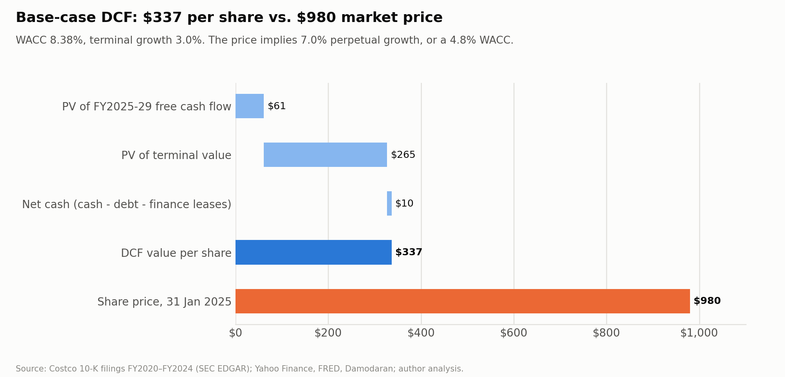

# WACC and DCF valuation (as of 31 January 2025)

*Independent academic research and valuation case study; not investment advice.*

- **Code:** [`src/wacc.py`](../src/wacc.py) and [`src/dcf.py`](../src/dcf.py).
- **Judgement calls:** [`config/valuation.json`](../config/valuation.json), each with its rationale.
- **Market data:** [`data/raw/market/`](../data/raw/market/). The [manifest](../data/raw/market/manifest.csv) records the source URL and SHA-256 of every file.
- **Output tables:** `outputs/tables/wacc.csv`, `dcf_ufcf.csv`, `dcf_summary.csv`, `peer_betas.csv`.



## 1. Cost of capital

| Input | Value | Source / method |
|---|---:|---|
| Risk-free rate | 4.58% | 10-year U.S. Treasury, 31 Jan 2025 (FRED `DGS10`) |
| Equity risk premium | 4.33% | Damodaran implied ERP (FCFE), start of 2025 |
| Raw beta | 0.84 | 60 monthly total returns vs. S&P 500, Feb 2020–Jan 2025 (R² 0.44, standard error 0.12) |
| Adjusted beta (Blume) | 0.89 | 0.67 × raw + 0.33 |
| **Cost of equity** | **8.45%** | CAPM: 4.58% + 0.89 × 4.33% |
| Pre-tax cost of debt | 5.15% | Treasury + average of ICE BofA AA (0.46%) and A (0.69%) spreads |
| After-tax cost of debt | 3.81% | 26% tax rate |
| Equity (market value) | $435.9bn | $979.88 × 444.8m diluted shares |
| Debt incl. finance leases | $6.8bn | Fair value of notes $5,273m (Q1 FY25 10-Q) + finance leases $1,498m (FY24 10-K) |
| Weights (E / D) | 98.5% / 1.5% | Market values |
| **WACC** | **8.38%** | |

**Beta cross-check.** Peer betas (Walmart, BJ's, Target, Dollar General, Dollar Tree and Kroger) are unlevered with the Hamada formula, and the median is relevered to Costco's capital structure. The result is 0.62 (Blume-adjusted). That gives a WACC of **7.23%** and a value of **$425/share**.

I use Costco's own beta because it is statistically much better determined: peer R² values are 0.03–0.39 (see `outputs/tables/peer_betas.csv`). The peer figure shows how much the answer depends on beta.

## 2. Unlevered free cash flow

`UFCF = EBIT × (1 − 26%) + D&A − capex − increase in operating working capital`.

Stock-based compensation stays in EBIT as a real cost; it is not added back.

| $m | FY25E (stub) | FY26E | FY27E | FY28E | FY29E |
|---|---:|---:|---:|---:|---:|
| EBIT | 10,187 | 11,089 | 11,792 | 12,477 | 13,165 |
| NOPAT | 7,538 | 8,206 | 8,726 | 9,233 | 9,742 |
| + D&A | 2,439 | 2,654 | 2,886 | 3,129 | 3,379 |
| − Capex | (5,000) | (5,422) | (5,771) | (6,111) | (6,466) |
| + Working capital released | 1,015 | 1,035 | 916 | 891 | 918 |
| **UFCF (full year)** | **5,992** | **6,473** | **6,757** | **7,141** | **7,573** |
| Share of year counted | 77% | 100% | 100% | 100% | 100% |
| **UFCF counted** | **4,610** | **6,473** | **6,757** | **7,141** | **7,573** |
| Discount time (years) | 0.20 | 1.08 | 2.08 | 3.08 | 4.09 |
| PV of UFCF | 4,537 | 5,935 | 5,717 | 5,573 | 5,450 |

**The FY2025 stub.** Net debt is taken from the latest balance sheet, dated 24 Nov 2024. So FY2025 counts only the cash generated *after* that date: 40 of 52 weeks, or 77%. Each flow is discounted from 31 Jan 2025 to the midpoint of its period (the mid-year convention).

## 3. Terminal value

The terminal value uses the perpetual-growth method, `TV = FCF(FY2030) ÷ (WACC − g)`, with g = 3.0%.

FCF(FY2030) comes from the **value-driver formula**, so reinvestment is consistent with the growth assumed:

```
NOPAT(FY2030) = EBIT(FY2029) × (1 + g) × (1 − T)  = 13,165 × 1.03 × 0.74 = 10,035
Reinvestment  = g ÷ RONIC = 3% ÷ 25%               = 12% of NOPAT
FCF(FY2030)   = 10,035 × (1 − 12%)                 = 8,830
TV            = 8,830 ÷ (8.38% − 3.0%)             = $164.1bn   →  PV $118.1bn
```

**Checks on the terminal value:**
- **Implied exit multiple: 10.3× FY2029 EBITDA** at FY2029 year-end, the basis a trading multiple is measured on. The formula
  gives $164.1bn one year before the first perpetuity flow's mid-point, i.e. a mid-year basis (9.9×). Restated to year-end,
  TV × (1 + WACC)^0.5 = $170.8bn, which is 10.3×. Both carry the same present value. (The market EV is 26× FY2029E EBITDA.)
- **Terminal FCF is 17% above FY2029 UFCF** ($8.83bn vs. $7.57bn). Reinvestment falls from about 22% of NOPAT in FY2029
  (capex growth to support ~6% revenue growth) to 12% (g ÷ RONIC) once growth drops to 3%. This is what the value-driver
  formula is designed to do; the alternative of growing FY2029 UFCF at 3% gives $306 (section 6).
- It is **81% of enterprise value**, slightly above the 80% level at which reviewers usually ask for stress tests
  (see docs/sensitivity.md, including a WACC × exit-multiple cross-check).

## 4. Enterprise value to value per share

| | $m |
|---|---:|
| PV of UFCF (stub FY25–FY29) | 27,212 |
| PV of terminal value | 118,059 |
| **Enterprise value** | **145,271** |
| + Cash and short-term investments (24 Nov 2024) | 11,827 |
| − Debt, carrying value (current $97m + long-term $5,745m) | (5,842) |
| − Finance lease liabilities (FY24 10-K lease note) | (1,498) |
| **Equity value** | **149,758** |
| Diluted shares (443.9m basic at 11 Dec 2024 + 0.9m RSU dilution) | 444.8m |
| **Value per share** | **$337** |
| Share price, 31 Jan 2025 | $979.88 |
| Difference | **−66%** |

**Why operating leases are not deducted.** Under ASC 842, operating lease cost sits inside SG&A, so it is already subtracted in EBIT and UFCF. Deducting the lease liability as debt as well would count the same obligation twice.

## 5. Reverse DCF: what the $980 price assumes

Holding the base-case forecast fixed, the market price requires **one** of the following:

| Assumption the price needs | Base case | Required to reach $980 |
|---|---:|---:|
| Perpetual growth after FY2029 | 3.0% | **7.0%** |
| WACC | 8.38% | **4.8%** (an equity risk premium of 0.3%) |

At the price, Costco trades at **34× FY2025E EBITDA and 57× FY2025E EPS**; the DCF value corresponds to 11.5× EBITDA.

Two ways to read these numbers:
- **The implied WACC of 4.8% is only about 0.2pp above the 10-year Treasury yield (4.58%).** The price treats Costco's cash
  flows as close to risk-free.
- **7% perpetual growth is not a credible alternative.** It exceeds long-run nominal GDP growth and would require
  reinvesting 28% of NOPAT (7% ÷ 25%) forever.
- **As an exit multiple,** the price needs Costco to be worth **35× FY2029 EBITDA** at FY2029 year-end, against 10.3× in the
  base case and roughly 20× for Walmart today.

### How long would high growth have to last?

"7% growth forever" is abstract, so the table below asks a more concrete question. After FY2029, how many more years would Costco need to grow at a high rate before settling to 3%?

The test is deliberately generous. Reinvestment always matches growth: FCF = NOPAT × (1 − growth ÷ RONIC), with RONIC at 25%.

| Growth rate after FY2029 | Value if it lasts 10 years | 20 years | 100 years | Years needed to justify $980 |
|---|---:|---:|---:|---:|
| 6% | $390 | $433 | $575 | never |
| 7% | $411 | $475 | $780 | never |
| 8% | $433 | $525 | $1,159 | 76 |
| 10% | $482 | $650 | $3,425 | 37 |

At the peer-beta WACC of 7.23%, 7% growth would need 53 more years and 10% growth 22 years (`outputs/tables/reverse_dcf_growth_duration.csv`).
For scale, 10% growth for 37 years would make Costco about 34 times its FY2029 size.

**Interpretation.**
- **The short forecast horizon is not what drives the gap.** Even with generous extensions, a standard CAPM discount rate cannot reach the price.
- **The market is pricing something else.** The price is consistent with either many decades of high growth, or a much lower required return: investors treating Costco's membership income as close to bond-like (the 4.8% implied WACC).
- **Only $61 of the $980 comes from FY2025–29 cash flow.**
- **What the DCF does and doesn't show.** It does not prove the stock will fall. It shows that the price depends on either very long-lived growth or a very low discount rate. Phase 5 (comparable companies) tests whether that is specific to Costco.

## 6. Method choices that move the answer

This is the reconciliation the project guideline asks for. It explains why another tool fed the same inputs could give a different number:

| Choice | This model | Alternative | Effect on value/share |
|---|---|---|---:|
| Terminal value timing | Consistent with mid-year flows | Discount TV from end of FY2029 | $337 → $326 |
| Terminal cash flow | Value-driver (RONIC 25%) | FY2029 UFCF × (1 + g) | $337 → $306 |
| Beta | Costco regression, Blume-adjusted (0.89) | Raw regression beta (0.84); WACC 8.16% | $337 → $351 |
| Beta | Costco regression (0.89) | Peer median relevered (0.62) | $337 → $425 |
| Equity risk premium | Implied, 4.33% | Historical-style 5.0% | $337 → $305 |
| Cash | All treated as excess | All treated as operating | $337 → $310 |
| Net debt | Excludes operating leases | Also deduct operating leases | Double-counts ~$2.6bn (≈ −$6) |

## 7. Limitations

- **Short horizon.** With a 5-year explicit forecast, 81% of value sits in the terminal value. The terminal growth rate and RONIC therefore dominate, and Phase 6 tests them.
- **Balance-sheet timing.** Net debt comes from 24 Nov 2024 (the latest filing); movements between then and 31 Jan 2025 are not captured.
- **Stub calculation.** The FY2025 stub uses 40/52 of the full-year cash flow, which ignores seasonality. The holiday quarter falls inside the stub.
- **Beta.** Historical and backward-looking. The 2020–21 pandemic period is inside the regression window.
- **Finance-lease additions.** Assets acquired under finance leases are non-cash, so they are not in capex. Reinvestment is
  slightly understated; the effect is minor (finance leases are $1.5bn in total).
- **Presentation rounding.** Inputs shown rounded (beta 0.89, cost of debt 5.15%) give a WACC of 8.36%; the model uses
  unrounded inputs (beta 0.8946, 5.155%), which give 8.38%.
- **Cost of debt.** Uses AA/A index spreads, not Costco-specific bond yields. Debt is 1.5% of capital, so the effect is negligible.

## 8. Data collection note

Yahoo Finance and FRED rejected scripted downloads: they rate-limited or timed out the requests, and the Stooq fallback returned a browser-verification page instead of data. So prices and rates were retrieved in a browser session on the author's machine and saved to `data/raw/market/`. Each price file was checked against a checksum computed from the source response. `src/market_fetch.py` remains in the repo for anyone whose network allows scripted access.
